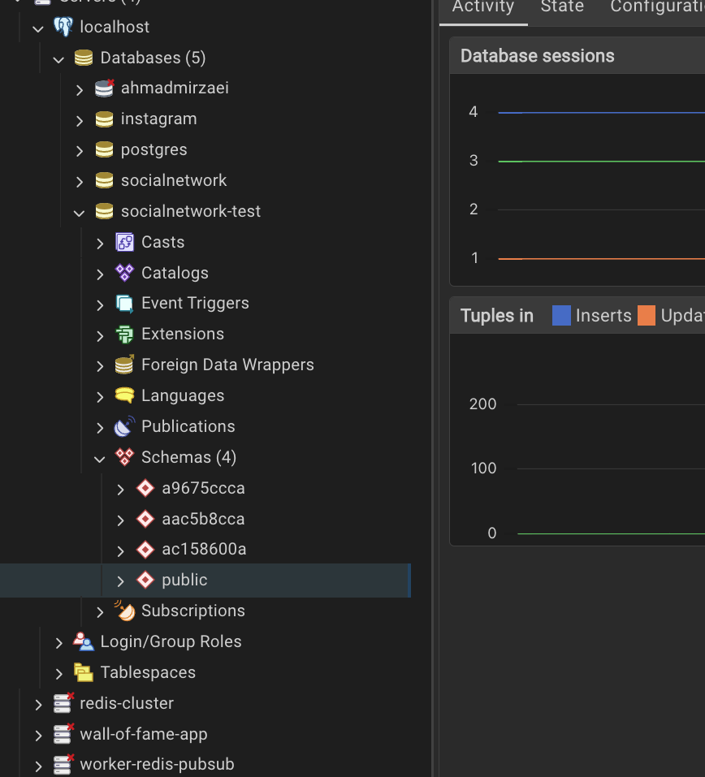

### This repo main goal:

1. Apply repository pattern in a simple node project
2. Show how testing can be done with jest

### Testing

`npm run test` will run all tests in parallel (since we have `"test" : "jest --no-cache"` script)

the testing idea in this PoC is brilliant. we have 3 tests that are connecting into same `socialmedia-test` db but due to parallel tests run by jest -> we will run into issues!

The solution was to have different schemas in postgres to run each test within (maybe it's over kill if you look in to postgress schemas, but now you have an isolates env/schema to perform your tests within it).

### what happen in each test?

all you can find it in `test/context.js` which is a setup class for each test individually. but in terms of what happens:

1. we randomly create a role name to connect to PG
2. we connect to PG as root user (why root? b/c we want to create the test role)
3. we write a query to create a role
4. execute a query to create a schema
5. now disconnect from pg as root!

At this step our pg has the test schema! all is left is that run migrations to prepare the schema to have all tables and things ready for running test! what we do is:

1. run migrations programmatically
2. and finally... connect to pg (test db) as the role you created

all above process happens within `context.js/static async build() {...}` function and the result of that is going to be used within each individual test in beforeAll/beforeEach step depending on use case!

### Finally as result...

if you run `npm run test` it will execute all tests in parallel while each test going to be executed in different schemas (i took this screenshot to show the schemas in pg admin dashboard)

you see these random schemas ^?
all of them include a copy of public schema that in each, all migrations being run once and they were ready to each test to be run!

isn't that cool? :)
